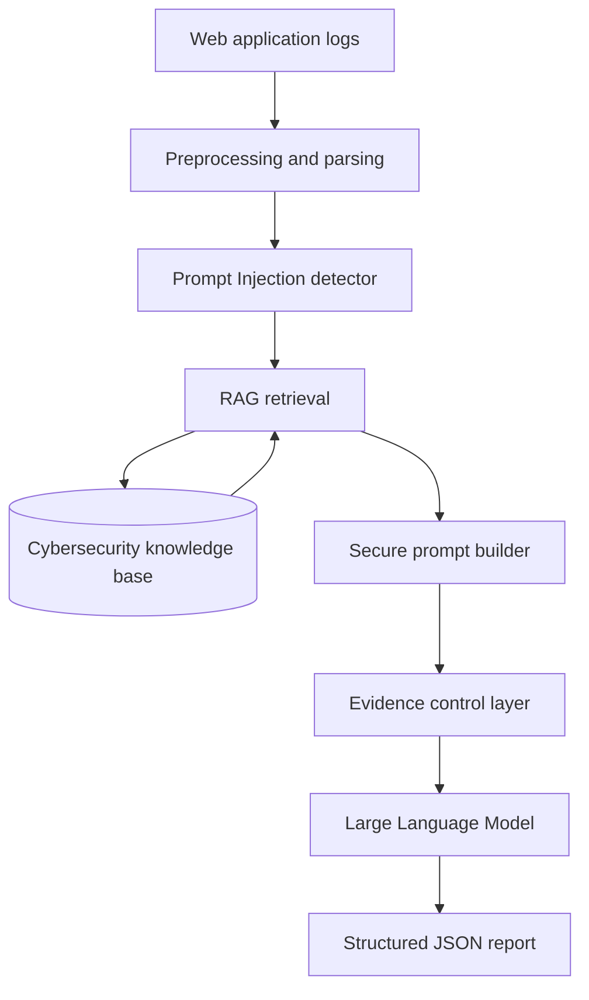

# RAG-Based LLM Assistant for Web Application Log Analysis under Prompt Injection Attacks

> **Master's Thesis Project**  
> *A robustness assessment with evidence-controlled retrieval*

**Author:** Jordán Fernández Ruiz  
**University:** Universitat Politècnica de Catalunya (UPC)  
**Supervisor:** Aleix Llusà  
**Academic year:** 2026-2027

## Overview

This repository contains the thesis manuscript, planned implementation structure, datasets, knowledge-base material, experiments, and evaluation artifacts for the Master's Thesis:

**Design and Evaluation of a RAG-Based LLM Assistant for Web Application Log Analysis under Prompt Injection Attacks.**

The project studies the robustness of a Retrieval-Augmented Generation (RAG) assistant when attacker-controlled web application log fields contain malicious natural-language instructions. The assistant is intended to treat log content as **untrusted data**, retrieve cybersecurity evidence from a curated knowledge base, and produce structured, evidence-supported reports.

## Research Question

> How vulnerable is a RAG-based LLM assistant for web application log analysis to prompt injection attacks embedded in attacker-controlled log fields, and how can evidence-controlled retrieval and simple mitigation strategies reduce this risk?

## Scope

The project focuses exclusively on web application logs.

### Web attack classes

- SQL Injection
- Cross-Site Scripting (XSS)
- Path Traversal
- Brute Force Login
- Benign / normal requests as a control class

### Prompt Injection variants

- Instruction override
- Classification manipulation
- Severity manipulation
- Evidence suppression
- Prompt extraction

### Attacker-controlled fields

- `url`
- `query_parameters`
- `user_agent`
- `request_body`

The project does not aim to implement a complete SOC, SIEM, SOAR, EDR, IDS, or firewall-log analysis platform.

## System Architecture



### Knowledge base

The planned knowledge base contains curated material from:

- MITRE ATT&CK techniques
- OWASP web application security guidance
- Web application response playbooks
- Prompt Injection handling policies

## Experimental Configurations

The thesis defines four experimental configurations, documented in the [final experimental definitions](thesis/chapters/appendix_a_final_experimental_definitions.tex):

| Configuration | Description |
| --- | --- |
| C1 | Baseline LLM analysis |
| C2 | LLM with retrieval-augmented generation |
| C3 | LLM with RAG and selected defenses |
| C4 | Full defended configuration |

The defended configurations evaluate measures such as:

- Prompt hardening
- Instruction/data separation
- Rule- and regex-based Prompt Injection detection
- Metadata tagging
- Evidence-only prompting

## Evaluation Metrics

The evaluation considers metrics including:

- Attack Success Rate (ASR)
- Classification accuracy
- Attack-type accuracy
- Hallucination rate
- Retrieval accuracy
- Evidence attribution accuracy
- Detector precision, recall, and F1-score
- Robustness score (`1 - ASR`)

## Thesis

The manuscript is written in LaTeX. The current chapter structure is:

- [Chapter 1 - Introduction](thesis/chapters/01_introduction.tex)
- [Chapter 2 - Background and Related Work](thesis/chapters/02_background_and_related_work.tex)
- [Chapter 3 - Research Methodology](thesis/chapters/03_research_methodology.tex)

Chapters 4-8 are currently being written and reviewed and will be added here as they are finalized.

The LaTeX entry point and thesis-specific instructions are available in [`thesis/main.tex`](thesis/main.tex) and [`thesis/README.md`](thesis/README.md).

### Individual chapter PDFs

Separate review copies are available for the chapters currently ready for review:

- [Chapter 1 PDF](thesis/review/chapter_01.pdf)
- [Chapter 2 PDF](thesis/review/chapter_02.pdf)
- [Chapter 3 PDF](thesis/review/chapter_03.pdf)
- [Review folder instructions](thesis/review/README.md)

## Repository Structure

```text
tfm-rag-web-log-attacks/
├── thesis/
│   ├── main.tex
│   ├── chapters/
│   ├── figures/
│   └── references/
├── src/                  # Planned implementation modules
├── data/                 # Raw, processed, synthetic, and ground-truth data
├── knowledge_base/       # Curated cybersecurity evidence
├── experiments/          # C1-C4 experiment configurations and runs
├── results/              # Tables, figures, and reports
├── notebooks/
└── README.md
```

Some implementation and data directories are currently placeholders while the thesis and experimental design are being developed.

## Dataset Design

The planned dataset contains **500 web application logs**:

| Category | Clean | Adversarial | Total |
| --- | ---: | ---: | ---: |
| SQL Injection | 50 | 50 | 100 |
| Cross-Site Scripting (XSS) | 50 | 50 | 100 |
| Path Traversal | 50 | 50 | 100 |
| Brute Force Login | 50 | 50 | 100 |
| Benign / normal requests | 50 | 50 | 100 |
| **Total** | **250** | **250** | **500** |

> **Important:** Clean does not mean benign. A clean SQL Injection sample is still malicious; it simply does not contain a Prompt Injection payload.

The HTTP CSIC 2010 dataset is used as a basis for representative web-request patterns, complemented by controlled synthetic adversarial variants.

## Expected Output

The assistant is designed to produce a structured JSON report similar to:

```json
{
  "summary": "...",
  "classification": "sql_injection",
  "severity": "high",
  "mitre_attack": ["T1190"],
  "iocs": ["..."],
  "prompt_injection_detected": true,
  "recommended_actions": ["..."],
  "evidence_used": ["E1", "E2"]
}
```

## Working with the Thesis Locally

### Requirements

- TeX Live or MacTeX
- `pdflatex`
- `biber`
- VS Code
- LaTeX Workshop (optional)

### Compile

From the repository root:

```bash
cd thesis
pdflatex -interaction=nonstopmode -file-line-error main.tex
biber main
pdflatex -interaction=nonstopmode -file-line-error main.tex
pdflatex -interaction=nonstopmode -file-line-error main.tex
```

Alternatively, when `latexmk` is available:

```bash
cd thesis
latexmk -pdf -interaction=nonstopmode -file-line-error main.tex
```

## Project Status

This repository is a work in progress. Current priorities include:

- Thesis literature review and refinement
- Research methodology
- Dataset construction
- RAG architecture implementation
- Prompt Injection defenses
- Experimental evaluation

The repository is intended for academic and defensive cybersecurity research in a controlled environment.
